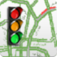
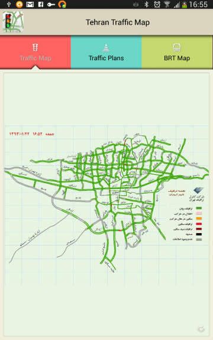
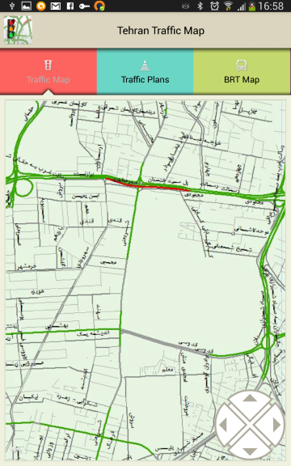

#  Tehran Traffic Map  

Tehran and Iran Roads Traffic Maps Android Application
Designed By: <a href="http://mohsenoid.com" target="_blank"><b>Mohsen Mirhoseini</b></a>

 

This app uses your mobile internet connection to show a real-time Traffic info about surface street traffic conditions within the city of Tehran. All information received from "Tehran Traffic Control Co." cameras services and visualize on a map.
It also lets you zoom on the streets and compare new received and older map.

Published at: <a href="https://play.google.com/store/apps/details?id=com.tehran.traffic"> Google Play</a> | <a href="http://cafebazaar.ir/app/com.tehran.traffic" target="_blank">Cafe Bazaar</a> | <a href="http://cando.asr24.com/app.jsp?appId=291953" target="_blank">Cando Market</a>

## License

Copyright 2013 Mohsen Mirhoseini Argi

Licensed under the Apache License, Version 2.0 (the "License");
you may not use this file except in compliance with the License.
You may obtain a copy of the License at

   http://www.apache.org/licenses/LICENSE-2.0

Unless required by applicable law or agreed to in writing, software
distributed under the License is distributed on an "AS IS" BASIS,
WITHOUT WARRANTIES OR CONDITIONS OF ANY KIND, either express or implied.
See the License for the specific language governing permissions and
limitations under the License.
